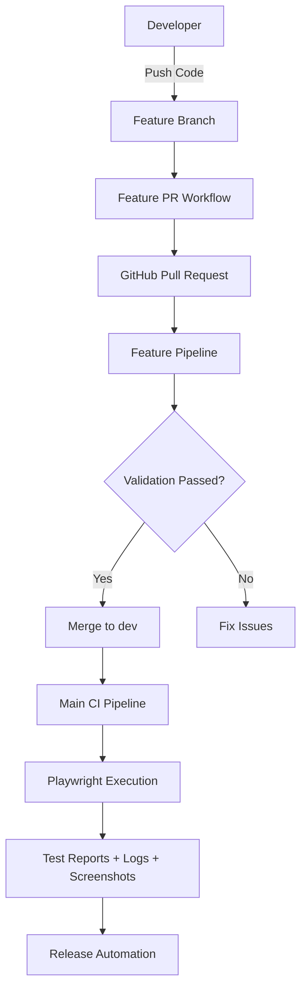
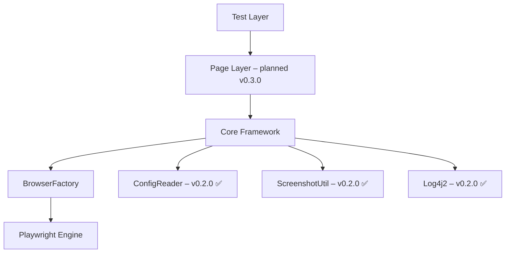
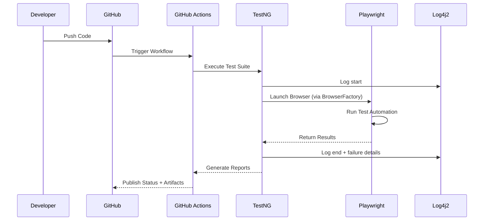
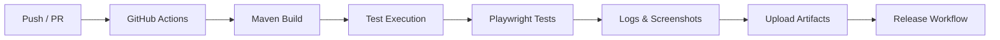

# 🚀 Playwright Java Hybrid Framework – v0.2.0

<p align="center">


</p>

<p align="center">
Enterprise‑grade hybrid automation framework – Java + Playwright + TestNG + Log4j2, with strict CI/CD governance and automated repository management.
</p>

---

# 📚 Table of Contents

- [📌 Project Overview](#-project-overview)
- [✨ Key Features](#-key-features)
- [🆕 What's New in v0.2.0](#-whats-new-in-v020)
- [⚙️ Technology Stack](#️-technology-stack)
- [🧠 System Architecture](#-system-architecture)
- [🧱 Framework Design Layers](#-framework-design-layers)
- [🔁 Execution Workflow](#-execution-workflow)
- [⚙️ CI/CD Architecture](#️-cicd-architecture)
- [🧪 Test Example with Logging](#-test-example-with-logging)
- [📁 Project Structure](#-project-structure)
- [⚙️ Setup & Installation](#️-setup--installation)
- [📝 Configuration](#-configuration)
- [▶️ Test Execution](#️-test-execution)
- [📊 Logging & Reporting](#-logging--reporting)
- [⏱️ Release PR Behaviour](#️-release-pr-behaviour)
- [🌿 Branching Strategy](#-branching-strategy)
- [🧮 Semantic Versioning](#-semantic-versioning)
- [🛣️ Roadmap](#️-roadmap)
- [🤝 Contributing](#-contributing)
- [👨‍💻 Author](#-author)
- [📜 License](#-license)

---

# 📌 Project Overview

Nova Hybrid Framework is a scalable UI automation framework built using modern enterprise principles.  
**v0.2.0** introduces a full logging subsystem, configuration management, screenshot utility, and a centralised browser factory.

The framework combines:

- ✅ Java 21
- ✅ Playwright 1.59.0
- ✅ TestNG 7.12.0
- ✅ Log4j2 2.26.0
- ✅ Maven Build Lifecycle
- ✅ GitHub Actions CI/CD
- ✅ Automated Release Workflows
- ✅ Repository Governance
- ✅ Semantic Versioning

---

# ✨ Key Features

| Capability                     | v0.0.0 | v0.1.0 | v0.2.0 |
| ------------------------------ | ------ | ------ | ------ |
| Project Skeleton & CI          | ✅      | ✅      | ✅      |
| Playwright + TestNG            | ❌      | ✅      | ✅      |
| First Runnable Test            | ❌      | ✅      | ✅      |
| **Log4j2 Logging**             | ❌      | ❌      | ✅      |
| **Configuration Manager**      | ❌      | ❌      | ✅      |
| **Screenshot Utility**         | ❌      | ❌      | ✅      |
| **Browser Factory (configurable)** | ❌   | ❌      | ✅      |
| Page Object Model              | ❌      | ❌      | ⏳      |
| Data‑Driven Testing            | ❌      | ❌      | ⏳      |

---

# 🆕 What's New in `v0.2.0`

## 🚀 Major Enhancements

- **Log4j2 Integration** – console and file logging with configurable levels.
- **ConfigReader** – load runtime settings from `config.properties`.
- **BrowserFactory** – centralised browser creation (supports headless, slowMo, multiple engines).
- **ScreenshotUtil** – capture PNG screenshots manually or on test failure.
- **CI Artifacts** – logs and screenshots automatically uploaded.

## 📈 Upgrade Summary

| Component        | v0.1.0                        | v0.2.0                           |
| ---------------- | ----------------------------- | -------------------------------- |
| Logging          | `System.out.println`          | Log4j2 (info, debug, error)      |
| Configuration    | Hardcoded                     | `config.properties` + env overrides |
| Browser creation | Inside test class             | `BrowserFactory` (reusable)      |
| Screenshots      | None                          | Automatic on failure              |

---

# ⚙️ Technology Stack

| Technology     | Version  |
| -------------- | -------- |
| Java           | 21       |
| Maven          | 3.9+     |
| Playwright     | 1.59.0   |
| TestNG         | 7.12.0   |
| Log4j2         | 2.26.0   |
| GitHub Actions | Latest   |

---

# 🧠 System Architecture



---

# 🧱 Framework Design Layers


---

# 🔁 Execution Workflow


---

# ⚙️ CI/CD Architecture


---

# 🧪 Test Example with Logging
The TC_001 test now uses Log4j2 instead of System.out. See the updated code below.
```java
package tests;

import org.apache.logging.log4j.LogManager;
import org.apache.logging.log4j.Logger;
import org.testng.Assert;
import org.testng.annotations.AfterTest;
import org.testng.annotations.BeforeTest;
import org.testng.annotations.Test;
import com.microsoft.playwright.*;

public class TC_001 {

    private static final Logger log = LogManager.getLogger(TC_001.class);
    private Playwright playwright;
    private Browser browser;
    private Page page;

    @BeforeTest
    public void setUp() {
        log.info("========== TEST SETUP STARTED ==========");
        playwright = Playwright.create();
        // Read config (simplified – actually use ConfigReader)
        boolean headless = Boolean.parseBoolean(System.getProperty("headless", "true"));
        browser = playwright.chromium().launch(new BrowserType.LaunchOptions().setHeadless(headless));
        page = browser.newPage();
        log.info("Browser launched – headless: {}", headless);
        log.info("========== TEST SETUP COMPLETED ==========");
    }

    @Test
    public void testTextBoxForm() {
        log.info("========== TEST EXECUTION STARTED ==========");
        log.info("Navigating to DemoQA...");
        page.navigate("https://demoqa.com");
        log.debug("Current URL: {}", page.url());

        log.info("Clicking Elements card...");
        page.click("div.card-body:has-text('Elements')");
        log.info("Clicking Text Box menu...");
        page.click("span.text:has-text('Text Box')");

        log.info("Filling form fields...");
        page.fill("#userName", "Anuj Kumar");
        page.fill("#userEmail", "anuj@example.com");
        page.fill("#currentAddress", "New Delhi, India");
        page.fill("#permanentAddress", "Bangalore, India");

        log.info("Submitting form...");
        page.click("#submit");

        log.info("Validating output...");
        boolean isVisible = page.isVisible("#output");
        log.info("Output visible: {}", isVisible);
        Assert.assertTrue(isVisible, "Output div should be visible after submission");

        log.info("========== TEST EXECUTION COMPLETED ==========");
    }

    @AfterTest
    public void tearDown() {
        log.info("========== TEST TEARDOWN STARTED ==========");
        if (browser != null) {
            browser.close();
            log.info("Browser closed.");
        }
        if (playwright != null) {
            playwright.close();
            log.info("Playwright closed.");
        }
        log.info("========== TEST TEARDOWN COMPLETED ==========");
    }
}
```
> 
> Note: In v0.2.0, BrowserFactory and ConfigReader are used; the above is simplified for illustration.

---

# 📁 Project Structure
```text
hybrid-framework/
├── .github/
│   ├── workflows/
│   │   ├── feature-pr.yml
│   │   ├── main-ci.yml
│   │   └── release-pr.yml
│   ├── features/
│   │   └── v0.2.0-core-utilities-configuration.md
│   ├── issues/
│   └── releases/
│       └── v0.2.0.md
├── scripts/                     # Bash automation scripts
├── src/
│   ├── main/java/
│   │   ├── BrowserFactory.java
│   │   ├── ConfigReader.java
│   │   └── ScreenshotUtil.java
│   └── test/
│       ├── java/tests/TC_001.java
│       └── resources/
│           ├── log4j2.xml
│           └── config.properties
├── logs/                        # Generated log files
├── screenshots/                 # Generated screenshots
├── testng.xml
├── pom.xml
└── README.md
```

---

# ⚙️ Setup & Installation
## 📋 Prerequisites
- **Java** `21`

- **Maven** `3.8+`

- **Git** `2.30+`

- *GitHub CLI* (optional)

## 📥 Clone & Build
```bash
git clone https://github.com/opencode-qa/hybrid-framework.git
cd hybrid-framework
mvn clean install
```

## 🌐 Install Playwright Browsers
```bash
mvn exec:java -Dexec.mainClass=com.microsoft.playwright.CLI -Dexec.args="install"
```
# 📝 Configuration
Create `src/test/resources/config.properties`:

```properties
# Browser settings
browser=chromium          # chromium, firefox, webkit
headless=true
slowMo=100                # milliseconds

# Application
base.url=https://demoqa.com

# Screenshots
screenshot.on.failure=true
screenshot.dir=./screenshots
```

Use ConfigReader in your tests:

```java
String browserType = ConfigReader.getProperty("browser");
boolean headless = Boolean.parseBoolean(ConfigReader.getProperty("headless"));
```

# ▶️ Test Execution
```bash
# Run all tests
mvn test

# Run specific test
mvn test -Dtest=TC_001

# Override headless mode
mvn test -Dheadless=false

# Override browser
mvn test -Dbrowser=firefox
```

## 📊 Logging & Reporting
Log4j2 is configured via `src/main/resources/log4j2.xml`:

- **Console** – coloured, timestamped, levels.

- **File** – logs/automation.log (rolling file, appended each run).

Sample console output:

```text
10:30:45.123 [main] INFO  tests.TC_001 - ========== TEST SETUP STARTED ==========
10:30:45.456 [main] INFO  tests.TC_001 - Browser launched – headless: true
```

Artifacts in CI:
After each run, GitHub Actions uploads `logs/` and `screenshots/` as downloadable artifacts.

# ⏱️ Release PR Behaviour
When a release is triggered via `release-pr.sh`:

1. Release branch (release/vX.Y.Z) created from dev

2. pom.xml version updated (removes -SNAPSHOT)

3. PR created from release branch → main

4. Pipeline waits up to 3 hours for manual merge

5. After merge: signed Git tag + GitHub Release created

6. dev is bumped to next -SNAPSHOT (e.g., 0.3.0-SNAPSHOT)
