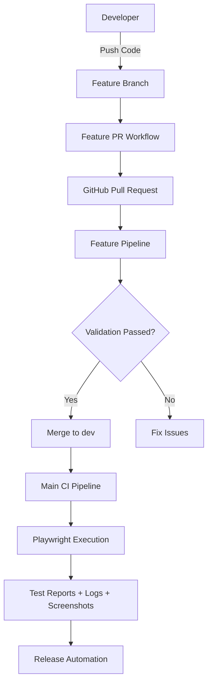
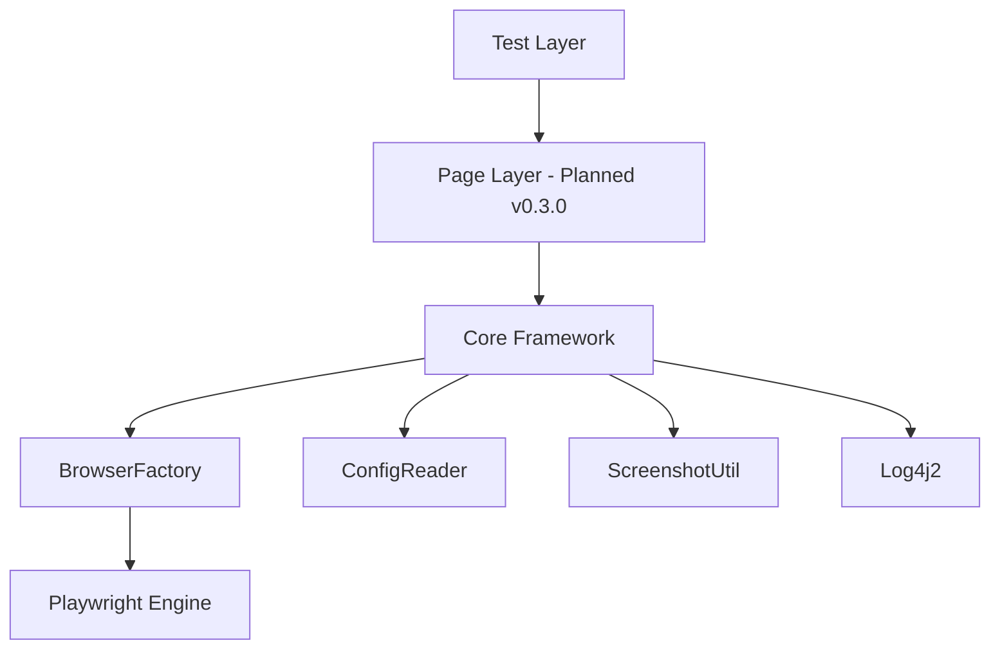
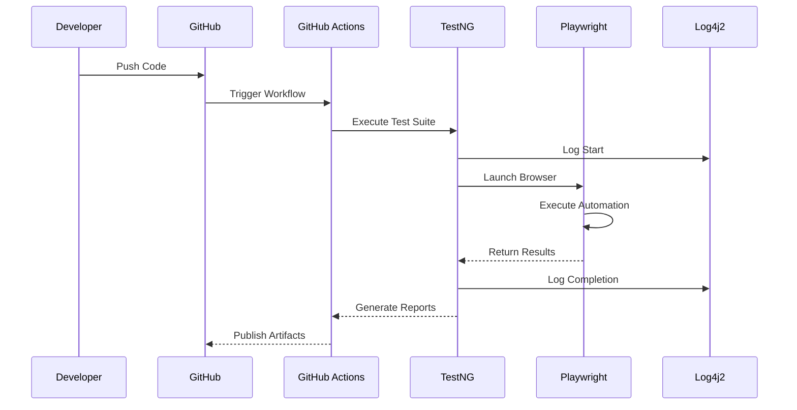
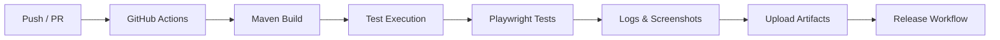
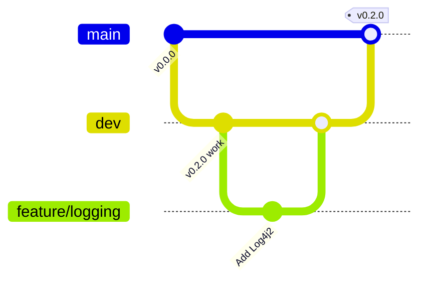

# 🚀 Playwright Java Hybrid Framework

<p align="center">


</p>

<p align="center">
Enterprise-grade hybrid automation framework built with Java, Playwright, TestNG, and Log4j2, featuring CI/CD governance, semantic versioning, and automated repository management.
</p>

---

# 📚 Table of Contents

* [📌 Project Overview](#-project-overview)
* [✨ Key Features](#-key-features)
* [🆕 What's New in v0.2.0](#-whats-new-in-v020)
* [⚙️ Technology Stack](#️-technology-stack)
* [🧠 System Architecture](#-system-architecture)
* [🧱 Framework Design Layers](#-framework-design-layers)
* [🔁 Execution Workflow](#-execution-workflow)
* [⚙️ CI/CD Architecture](#️-cicd-architecture)
* [🧪 Test Example with Logging](#-test-example-with-logging)
* [📁 Project Structure](#-project-structure)
* [⚙️ Setup & Installation](#️-setup--installation)
* [📝 Configuration](#-configuration)
* [▶️ Test Execution](#️-test-execution)
* [📊 Logging & Reporting](#-logging--reporting)
* [⏱️ Release PR Behaviour](#️-release-pr-behaviour)
* [🌿 Branching Strategy](#-branching-strategy)
* [🧮 Semantic Versioning](#-semantic-versioning)
* [🛣️ Roadmap](#️-roadmap)
* [🤝 Contributing](#-contributing)
* [👨‍💻 Author](#-author)
* [📜 License](#-license)

---

# 📌 Project Overview

Nova Hybrid Framework is a scalable UI automation framework built using modern enterprise engineering principles.

Version **v0.2.0** introduces:

* Log4j2 logging subsystem
* Centralised configuration management
* Screenshot utilities
* BrowserFactory abstraction
* CI artifact publishing

The framework combines:

* ✅ Java 21
* ✅ Playwright 1.59.0
* ✅ TestNG 7.12.0
* ✅ Log4j2 2.26.0
* ✅ Maven
* ✅ GitHub Actions
* ✅ Automated Release Workflows
* ✅ Repository Governance
* ✅ Semantic Versioning

---

# ✨ Key Features

| Capability            | v0.0.0 | v0.1.0 | v0.2.0 |
| --------------------- | ------ | ------ | ------ |
| Project Skeleton & CI | ✅      | ✅      | ✅      |
| Playwright + TestNG   | ❌      | ✅      | ✅      |
| First Runnable Test   | ❌      | ✅      | ✅      |
| Log4j2 Logging        | ❌      | ❌      | ✅      |
| Configuration Manager | ❌      | ❌      | ✅      |
| Screenshot Utility    | ❌      | ❌      | ✅      |
| Browser Factory       | ❌      | ❌      | ✅      |
| Page Object Model     | ❌      | ❌      | ⏳      |
| Data-Driven Testing   | ❌      | ❌      | ⏳      |

---

# 🆕 What's New in v0.2.0

## 🚀 Major Enhancements

### Log4j2 Integration

* Console logging
* Rolling file logging
* Configurable log levels

### ConfigReader

* Centralized configuration loading
* Runtime property access
* Environment overrides

### BrowserFactory

* Browser abstraction layer
* Chromium, Firefox, WebKit support
* Headless and slowMo configuration

### ScreenshotUtil

* Manual screenshots
* Automatic failure screenshots
* CI artifact support

### CI Artifacts

* Logs uploaded automatically
* Screenshots uploaded automatically

---

# ⚙️ Technology Stack

| Technology     | Version |
| -------------- | ------- |
| Java           | 21      |
| Maven          | 3.9+    |
| Playwright     | 1.59.0  |
| TestNG         | 7.12.0  |
| Log4j2         | 2.26.0  |
| GitHub Actions | Latest  |

---

# 🧠 System Architecture



---

# 🧱 Framework Design Layers



---

# 🔁 Execution Workflow



---

# ⚙️ CI/CD Architecture



---

# 🧪 Test Example with Logging

```java
private static final Logger log = LogManager.getLogger(TC_001.class);

@BeforeTest
public void setUp() {
    log.info("========== TEST SETUP STARTED ==========");
}

@Test
public void testTextBoxForm() {
    log.info("Navigating to DemoQA...");
    page.navigate("https://demoqa.com");

    boolean isVisible = page.isVisible("#output");
    Assert.assertTrue(isVisible);
}

@AfterTest
public void tearDown() {
    log.info("========== TEST TEARDOWN COMPLETED ==========");
}
```

> Full implementation available in `tests/TC_001.java`

---

# 📁 Project Structure

```text
hybrid-framework/
├── .github/
│   ├── workflows/
│   │   ├── feature-pr.yml
│   │   ├── main-ci.yml
│   │   └── release-pr.yml
│   ├── features/
│   ├── issues/
│   └── releases/
├── scripts/
├── src/
│   ├── main/java/
│   │   ├── BrowserFactory.java
│   │   ├── ConfigReader.java
│   │   └── ScreenshotUtil.java
│   └── test/
│       ├── java/tests/
│       └── resources/
├── logs/
├── screenshots/
├── testng.xml
├── pom.xml
└── README.md
```

---

# ⚙️ Setup & Installation

## Prerequisites

* Java 21
* Maven 3.9+
* Git 2.30+
* GitHub CLI (optional)

## Clone Repository

```bash
git clone https://github.com/opencode-qa/hybrid-framework.git
cd hybrid-framework
```

## Build Project

```bash
mvn clean install
```

## Install Playwright Browsers

```bash
mvn exec:java \
-Dexec.mainClass=com.microsoft.playwright.CLI \
-Dexec.args="install"
```

---

# 📝 Configuration

Create:

```properties
src/test/resources/config.properties
```

```properties
browser=chromium
headless=true
slowMo=100

base.url=https://demoqa.com

screenshot.on.failure=true
screenshot.dir=./screenshots
```

Example usage:

```java
String browser = ConfigReader.getProperty("browser");
boolean headless =
    Boolean.parseBoolean(ConfigReader.getProperty("headless"));
```

---

# ▶️ Test Execution

Run all tests:

```bash
mvn test
```

Run specific test:

```bash
mvn test -Dtest=TC_001
```

Run headed:

```bash
mvn test -Dheadless=false
```

Run with Firefox:

```bash
mvn test -Dbrowser=firefox
```

---

# 📊 Logging & Reporting

### Console Logging

* Colored output
* Timestamped entries
* Log levels

### File Logging

```text
logs/automation.log
```

### Sample Output

```text
10:30:45.123 INFO  TEST SETUP STARTED
10:30:45.456 INFO  Browser launched
10:30:46.001 INFO  Test execution started
```

### CI Artifacts

Automatically uploaded:

* logs/
* screenshots/

---

# ⏱️ Release PR Behaviour

1. Create `release/vX.Y.Z` from `dev`
2. Remove `-SNAPSHOT`
3. Create PR → `main`
4. Wait for approval and merge
5. Create Git tag
6. Publish GitHub Release
7. Bump `dev` to next snapshot version

Example:

```text
0.2.0
↓
0.3.0-SNAPSHOT
```

---

# 🌿 Branching Strategy

```text
main      → Production releases
dev       → Integration branch
feature/* → New features
release/* → Release preparation
hotfix/*  → Emergency fixes
```



---

# 🧮 Semantic Versioning

| Commit Type     | Version Impact |
| --------------- | -------------- |
| BREAKING CHANGE | Major (+1.0.0) |
| feat:           | Minor (+0.1.0) |
| fix: / chore:   | Patch (+0.0.1) |

---

# 🛣️ Roadmap

| Version | Milestone                      | Status |
| ------- | ------------------------------ | ------ |
| v0.0.0  | Project Skeleton & CI          | ✅      |
| v0.1.0  | Playwright + TestNG            | ✅      |
| v0.2.0  | Logging + Config + Screenshots | ✅      |
| v0.3.0  | Page Object Model              | 🚧     |
| v0.4.0  | Data-Driven Testing            | ⏳      |
| v0.5.0  | Network Mocking & Auth         | ⏳      |
| v0.6.0  | Visual Regression              | ⏳      |
| v0.7.0  | Parallel + Cross-Browser       | ⏳      |
| v0.8.0  | Retry & Listeners              | ⏳      |
| v0.9.0  | Allure Reporting               | ⏳      |
| v1.0.0  | Stable Enterprise Release      | ⏳      |

---

# 🤝 Contributing

```bash
git checkout -b feature/your-feature
git commit -m "feat: add amazing feature"
git push origin feature/your-feature
./scripts/feature-pr.sh
```

Requirements:

* Passing CI
* Logging implemented
* Code review approved

---

# 👨‍💻 Author

**Anuj Kumar**

🏅 QA Lead | Automation Architect | AI-Assisted Testing Specialist

* GitHub: Anuj-Patiyal
* LinkedIn: anuj-kumar-qa

---

# 📜 License

MIT License © 2026 Anuj Kumar

---

# 💡 Philosophy

> “First, solve the problem. Then, write the code.”

The framework follows a governance-first automation philosophy where CI/CD, quality gates, release management, and observability are established before large-scale feature expansion.

---

# ⭐ Support the Project

If you find this project useful:

* ⭐ Star the repository
* 🍴 Fork and contribute
* 🐞 Report issues
* 📢 Share with the automation community
