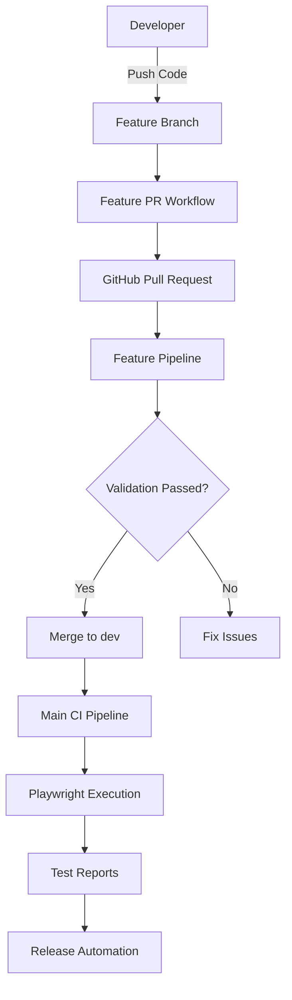
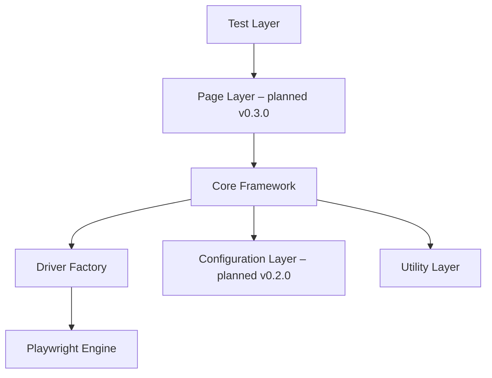
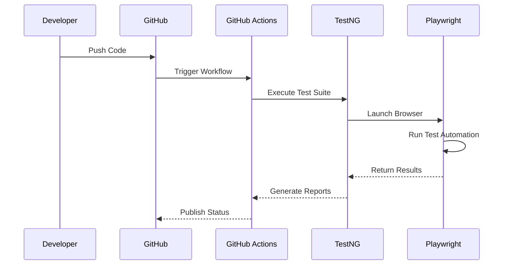
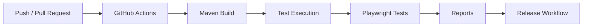
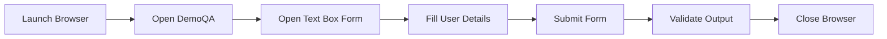
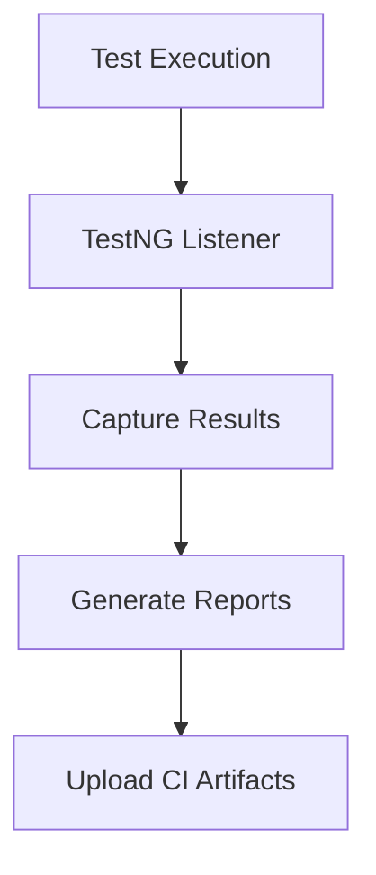
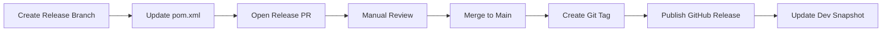
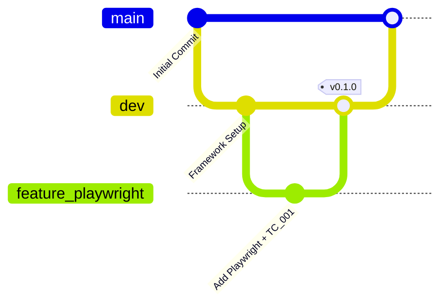
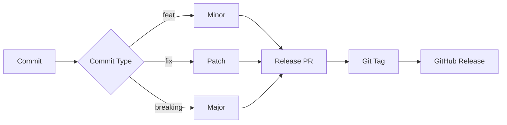

# 🚀 Playwright Java Hybrid Framework

<p align="center">


</p>

<p align="center">

Enterprise-grade Playwright + Java hybrid automation framework focused on scalability, CI/CD governance, repository automation, and modern testing architecture.

</p>

---

# 📚 Table of Contents

* [📌 Project Overview](#-project-overview)
* [✨ Key Features](#-key-features)
* [🆕 What's New in v0.1.0](#-whats-new-in-v010)
* [⚙️ Technology Stack](#️-technology-stack)
* [🧠 System Architecture](#-system-architecture)
* [🧱 Framework Design Layers](#-framework-design-layers)
* [🔁 Execution Workflow](#-execution-workflow)
* [⚙️ CI/CD Architecture](#️-cicd-architecture)
* [🧪 First Test Case — TC_001](#-first-test-case--tc_001)
* [📁 Project Structure](#-project-structure)
* [⚙️ Setup & Installation](#️-setup--installation)
* [▶️ Test Execution](#️-test-execution)
* [📊 Reporting Strategy](#-reporting-strategy)
* [⏱️ Release PR Behaviour](#️-release-pr-behaviour)
* [🌿 Branching Strategy](#-branching-strategy)
* [🧮 Semantic Versioning](#-semantic-versioning)
* [🛣️ Roadmap](#️-roadmap)
* [🤝 Contributing](#-contributing)
* [👨‍💻 Author](#-author)
* [📜 License](#-license)

---

# 📌 Project Overview

Nova Hybrid Framework is a scalable UI automation framework built using modern enterprise automation principles.

The framework combines:

* ✅ Java 21
* ✅ Playwright 1.59.0
* ✅ TestNG 7.12.0
* ✅ Maven Build Lifecycle
* ✅ GitHub Actions CI/CD
* ✅ Automated Release Workflows
* ✅ Repository Governance
* ✅ Semantic Versioning

---

## 🎯 Vision

The framework prioritises:

* Governance-first automation
* Scalable framework architecture
* Maintainable CI/CD workflows
* Automated repository management
* High-performance UI validation
* Long-term extensibility

---

# ✨ Key Features

| Capability                     | Status |
| ------------------------------ | ------ |
| Playwright Integration         | ✅      |
| TestNG Execution Engine        | ✅      |
| Maven Build Lifecycle          | ✅      |
| GitHub Actions CI/CD           | ✅      |
| Automated PR Workflows         | ✅      |
| Semantic Versioning            | ✅      |
| Browser Lifecycle Management   | ✅      |
| Reporting Foundation           | ✅      |
| First Runnable Test (`TC_001`) | ✅      |

---

# 🆕 What's New in `v0.1.0`

## 🚀 Major Enhancements

* Full Playwright integration
* TestNG execution support
* Browser lifecycle management
* Base test lifecycle
* Runnable automation engine
* Initial reporting foundation
* GitHub Actions test execution
* First working Playwright test (`TC_001`)

---

## 📈 Upgrade Summary

| Component  | v0.0.0          | v0.1.0              |
| ---------- | --------------- | ------------------- |
| Framework  | Skeleton        | Runnable Core       |
| Playwright | ❌               | ✅                   |
| Tests      | None            | `TC_001`            |
| Execution  | Validation Only | Runtime Execution   |
| CI/CD      | Governance      | Real Test Execution |

---

# ⚙️ Technology Stack

| Technology     | Version |
| -------------- | ------- |
| Java           | 21      |
| Maven          | 3.9+    |
| Playwright     | 1.59.0  |
| TestNG         | 7.12.0  |
| GitHub Actions | Latest  |

---

# 🧠 System Architecture



---

# 🧱 Framework Design Layers



---

# 🔁 Execution Workflow



---

# ⚙️ CI/CD Architecture



---

# 🧪 First Test Case — `TC_001`

## 🔄 Flow



---

## 💻 Actual Test Code (`v0.1.0`)

```java
package tests;

import org.testng.Assert;
import org.testng.annotations.AfterTest;
import org.testng.annotations.BeforeTest;
import org.testng.annotations.Test;

import com.microsoft.playwright.*;

public class TC_001 {

    Playwright playwright;
    Browser browser;
    Page page;

    @BeforeTest
    public void setUp() {

        playwright = Playwright.create();

        browser = playwright.chromium()
                .launch(new BrowserType.LaunchOptions()
                .setHeadless(true));

        page = browser.newPage();
    }

    @Test
    public void testTextBoxForm() {

        page.navigate("https://demoqa.com");

        page.click("div.card-body:has-text('Elements')");

        page.click("span.text:has-text('Text Box')");

        page.fill("#userName", "Anuj Kumar");

        page.fill("#userEmail", "anuj@example.com");

        page.fill("#currentAddress", "New Delhi, India");

        page.fill("#permanentAddress", "Bangalore, India");

        page.click("#submit");

        Assert.assertTrue(
                page.isVisible("#output"),
                "Output div should be visible after submission"
        );
    }

    @AfterTest
    public void tearDown() {

        if (browser != null) {
            browser.close();
        }

        if (playwright != null) {
            playwright.close();
        }
    }
}
```

> **Note:** `BaseTest`, `BrowserFactory`, logging, and config management are planned for `v0.2.0`.

---

# 📁 Project Structure

```plaintext
hybrid-framework/
├── .github/
│   ├── workflows/
│   │   ├── feature-pr.yml
│   │   ├── main-ci.yml
│   │   └── release-pr.yml
│   │
│   ├── features/
│   ├── issues/
│   └── releases/
│
├── scripts/
│   ├── feature-pr.sh
│   ├── release-pr.sh
│   ├── pom-validator.sh
│   ├── issues.sh
│   └── milestones.sh
│
├── src/
│   ├── main/java/
│   └── test/java/
│       └── tests/
│           └── TC_001.java
│
├── testng.xml
├── pom.xml
└── README.md
```

---

# ⚙️ Setup & Installation

## 📋 Prerequisites

* Java `17+`
* Maven `3.8+`
* Git `2.30+`
* GitHub CLI (`gh`) *(optional for automation scripts)*

---

## 📥 Clone Repository

```bash
git clone https://github.com/opencode-qa/hybrid-framework.git

cd hybrid-framework
```

---

## 📦 Install Dependencies

```bash
mvn clean install
```

---

## 🌐 Install Playwright Browsers

```bash
mvn exec:java \
-Dexec.mainClass=com.microsoft.playwright.CLI \
-Dexec.args="install"
```

---

# ▶️ Test Execution

## ▶️ Run All Tests

```bash
mvn test
```

---

## 🎯 Run Specific Test

```bash
mvn test -Dtest=TC_001
```

---

## 🧪 Execute TestNG Suite

```bash
mvn test -DsuiteXmlFile=testng.xml
```

---

# 📊 Reporting Strategy

## 🧰 Current Reporting Stack

* TestNG HTML/XML Reports
* Console Logs
* GitHub Actions Artifacts

---

## 🚀 Planned Reporting (`v0.9.0`)

* Allure Framework Integration
* Screenshots & Video Attachments
* Rich Dashboard Analytics
* Historical Trend Reports

---

## 🔄 Reporting Workflow



---

# ⏱️ Release PR Behaviour

When a release is triggered:

1. A release branch (`release/vX.Y.Z`) is created from `dev`
2. `pom.xml` version is updated
3. A PR from release branch → `main` is created
4. The workflow waits for manual review & merge
5. Git tag + GitHub Release are generated
6. `dev` is updated to next snapshot version

---

## 🔄 Release Automation Flow



---

# 🌿 Branching Strategy

## 🌱 Branch Rules

| Branch      | Purpose                   |
| ----------- | ------------------------- |
| `main`      | Production-ready releases |
| `dev`       | Integration branch        |
| `feature/*` | Active development        |
| `release/*` | Release preparation       |
| `hotfix/*`  | Emergency fixes           |

---

## 🔀 Git Flow



---

# 🧮 Semantic Versioning

The framework follows Semantic Versioning (`SemVer`).

| Commit Type        | Version Impact |
| ------------------ | -------------- |
| `BREAKING CHANGE:` | Major          |
| `feat:`            | Minor          |
| `fix:`             | Patch          |

---

## 🔄 Versioning Workflow



---

# 🛣️ Roadmap

| Version  | Milestone                      | Status |
| -------- | ------------------------------ | ------ |
| `v0.0.0` | Project Skeleton & CI/CD Setup | ✅      |
| `v0.1.0` | Playwright Core & TC_001       | ✅      |
| `v0.2.0` | Logging & Config Management    | 🚧     |
| `v0.3.0` | Page Object Model Architecture | ⏳      |
| `v0.4.0` | Data-Driven Framework          | ⏳      |
| `v0.5.0` | Network Mocking & Auth State   | ⏳      |
| `v0.6.0` | Visual Regression Testing      | ⏳      |
| `v0.7.0` | Parallel & Cross-Browser       | ⏳      |
| `v0.8.0` | Retry Logic & Listeners        | ⏳      |
| `v0.9.0` | Allure Reporting               | ⏳      |
| `v1.0.0` | Stable Enterprise Release      | ⏳      |

---

# 🤝 Contributing

```bash
# Create feature branch
git checkout -b feature/new-feature

# Commit changes
git commit -m "feat: add new feature"

# Push changes
git push origin feature/new-feature

# Create PR
./scripts/feature-pr.sh
```

All pull requests must pass:

* `feature-pr.yml`
* `main-ci.yml`

---

# 👨‍💻 Author

## Anuj Kumar

🏅 QA Lead | Automation Architect | AI-Assisted Testing Specialist

* 🔗 GitHub: https://github.com/opencode-qa
* 🔗 LinkedIn: https://linkedin.com/in/anuj-kumar-qa
* 📧 Email: [anujpatiyal@live.in](mailto:anujpatiyal@live.in)

---

# 📜 License

Distributed under the MIT License.

```text
MIT License © 2026 Anuj Kumar
```

---

# 💡 Philosophy

> “First, solve the problem. Then, write the code.”
>
> — John Johnson

Nova Hybrid Framework follows a governance-first automation philosophy where scalability, CI/CD architecture, repository automation, and maintainability are prioritised before implementation complexity.

---

# ⭐ Support the Project

If you find this project useful:

* ⭐ Star the repository
* 🍴 Fork the project
* 🛠️ Contribute improvements
* 🐞 Report issues
