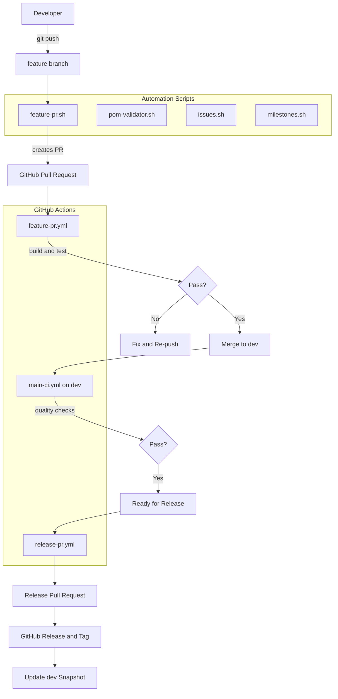
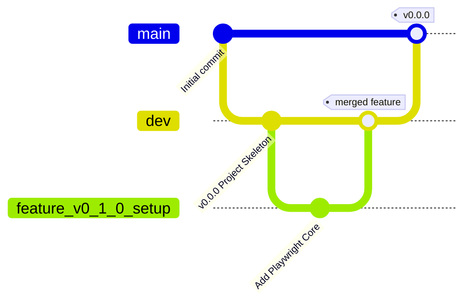
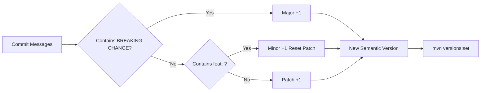
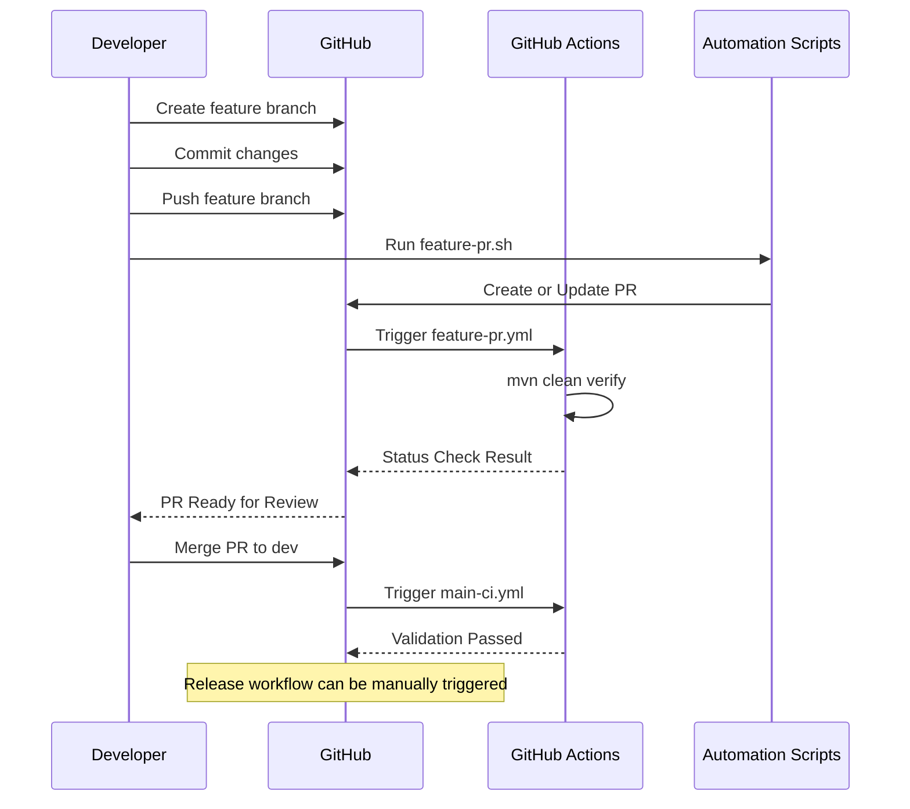

# 🚀 Playwright Java Hybrid Framework

## Project Skeleton & CI/CD Setup (v0.0.0)


> An enterprise-grade, highly scalable automation framework foundation using Java, Playwright, TestNG, and robust CI/CD governance.

---

# 📚 Table of Contents

1. [Project Overview](#-project-overview)
2. [Technical Architecture](#-technical-architecture)
3. [Branching Strategy](#-branching-strategy)
4. [Versioning Scheme](#-versioning-scheme)
5. [Initial Setup](#️-initial-setup)
6. [Repository Automation](#-repository-automation)
7. [Development Workflow](#-development-workflow)
8. [Future Roadmap](#️-future-roadmap)
9. [Contributing](#-contributing)
10. [Author](#-author)
11. [License](#-license)

---

# 📌 Project Overview

This project establishes the strict foundational architecture for a modern UI/API automation framework.

At `v0.0.0`, the primary focus is not on testing dependencies, but on:

- Repository governance
- CI/CD pipelines
- Automated script management

---

## 🎯 Goals of v0.0.0

- Establish the Maven `pom.xml` enforcing a minimum of:
  - `Java 17+`

- Implement strict GitHub Actions pipelines:
  - `main-ci.yml`
  - `feature-pr.yml`

- Deploy a custom milestone-gated POM Validator:
  - `pom-validator.sh v2.0`
  - HTML reporting support

- Automate repository operations using GitHub CLI (`gh`):
  - PR creation
  - Version bumping
  - Issue linking

---

# 🧱 Technical Architecture

## 📁 Folder Structure

```txt
hybrid-framework/
├── .github/
│   ├── features/           # Feature PR templates
│   ├── issues/             # Automated issue templates
│   ├── releases/           # Release PR templates
│   └── workflows/          # CI/CD Pipelines
│
├── scripts/                # Bash automation engine
│   ├── feature-pr.sh       # Automated feature PR creation
│   ├── release-pr.sh       # Version bumping & release orchestration
│   ├── issues.sh           # Batch issue generation
│   ├── milestones.sh       # Roadmap synchronization
│   └── pom-validator.sh    # Custom Maven dependency/plugin gatekeeper
│
├── src/
│   ├── main/java/          # Core framework utilities (future)
│   └── test/java/          # Playwright test execution (future)
│
├── pom.xml                 # Maven configuration
└── README.md               # Documentation
```

---

## 🧩 High-Level Component Diagram



---

# 🌿 Branching Strategy

We follow a strict Git Flow governed by GitHub Branch Protection rules.

---

## 🔀 Git Flow



---

## 🌱 Branch Rules

### `main`

- Protected production-ready code
- Commits allowed only via Release PRs

### `dev`

- Protected integration branch
- Commits allowed only via passing Feature PRs

### `feature/*`

- Active development branches

---

# 🧮 Versioning Scheme

We strictly follow Semantic Versioning (SemVer).

Versioning is automated during release pipelines using:

```bash
mvn versions:set
```

---

## 🔄 SemVer Automation Flow



---

## 📌 Current Baseline

```txt
v0.0.0
```

---

# ⚙️ Initial Setup

## ✅ Prerequisites

- Java JDK `17 or 21`
- Maven `3.8+`
- Git `2.30+`
- GitHub CLI (`gh`)

---

## 💻 Installation

### Clone Repository

```bash
git clone https://github.com/opencode-qa/hybrid-framework.git

cd hybrid-framework
```

---

### Authenticate GitHub CLI

```bash
gh auth login
```

---

### Run Local POM Validation

```bash
./scripts/pom-validator.sh --strict --html
```

---

# 🤖 Repository Automation

This framework utilizes a custom Bash scripting engine to automate repository management tasks.

| Script | Purpose | Execution |
|---|---|---|
| `pom-validator.sh` | Validates dependencies against milestone map and generates HTML reports | Local & CI |
| `feature-pr.sh` | Creates or updates Feature PRs and links issues automatically | Local |
| `release-pr.sh` | Bumps SemVer and generates release notes | GitHub Actions |
| `milestones.sh` | Synchronizes milestones with GitHub | Local |
| `issues.sh` | Batch creates GitHub issues from templates | Local |

---

# 🔁 Development Workflow



---

# 🛣️ Future Roadmap

| Version | Milestone Definition | Status |
|---|---|---|
| `v0.0.0` | Project Skeleton and CI Setup | ✅ Done |
| `v0.1.0` | Playwright Core and First Test (`TC_001`) | 🚧 Next |
| `v0.2.0` | Logging and Config Management | ⏳ Planned |
| `v0.3.0` | Page Object Model Architecture | ⏳ Planned |
| `v0.4.0` | Data-Driven Framework Setup | ⏳ Planned |
| `v0.5.0` | Advanced Playwright Features | ⏳ Planned |
| `v0.6.0` | Visual Regression Testing | ⏳ Planned |
| `v0.7.0` | Cross-Browser and Parallel Execution | ⏳ Planned |
| `v0.8.0` | TestNG Listeners and Retry Logic | ⏳ Planned |
| `v0.9.0` | Allure Reporting and Dashboard Integration | ⏳ Planned |
| `v1.0.0` | First Stable Master Release | ⏳ Planned |

---

# 🤝 Contributing

```bash
# Fork repository

# Create feature branch
git checkout -b feature/your-feature

# Commit changes
git commit -am "Add your feature"

# Push branch
git push origin feature/your-feature

# Execute automation script
./scripts/feature-pr.sh
```

---

# 👨‍💻 Author

## ANUJ KUMAR

🏅 QA Lead and AI-Assisted Testing Specialist

📧 Email: [anujpatiyal@live.in](mailto:anujpatiyal@live.in) | [anujpatiyal@gmail.com](mailto:anujpatiyal@gmail.com)

🔗 LinkedIn Profile: [`anuj-kumar-qa`](https://www.linkedin.com/in/anuj-kumar-qa/)

---

# 📜 License

Distributed under the MIT License (see LICENSE).

---

> “First, solve the problem. Then, write the code.”
>
> — John Johnson

This framework follows the principle of prioritizing governance, CI/CD, and automation architecture before implementation of actual test cases.
